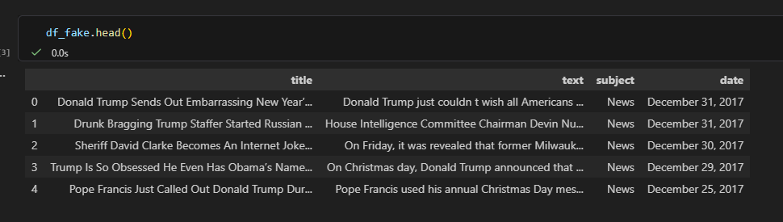
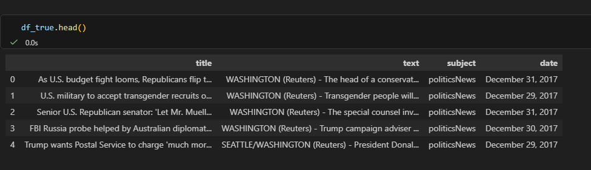
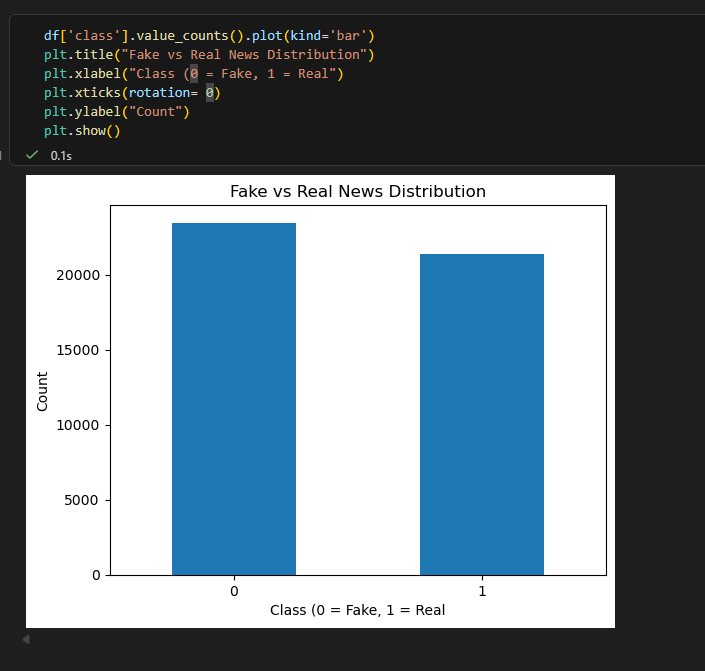
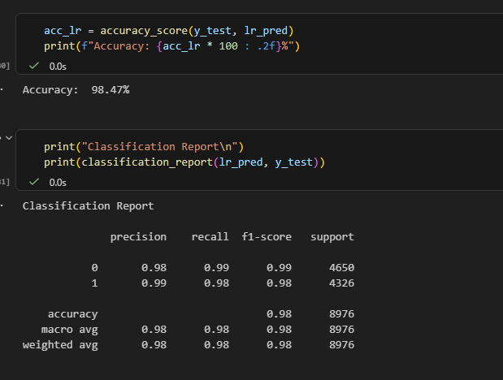
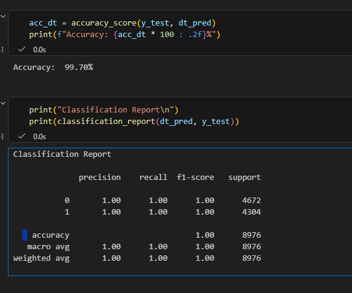
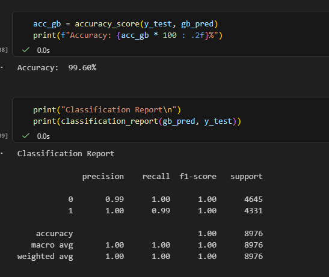
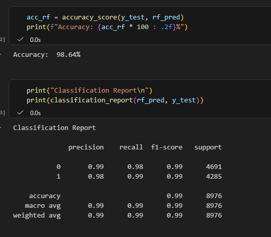
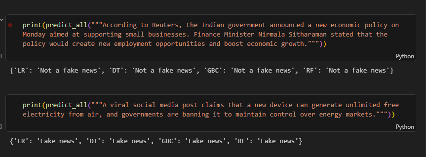

# Fake News Detection System

## Overview

This project is a **Machine Learning-based Fake News Detection system** that classifies news articles as **Fake or Real**.

The project was developed as part of my learning journey in machine learning, focusing on understanding the complete pipeline from data preprocessing to model evaluation.

## Models Used

* Logistic Regression
* Decision Tree Classifier
* Gradient Boosting Classifier
* Random Forest Classifier

## Tech Stack

* Python
* Pandas, NumPy
* Scikit-learn
* Matplotlib, Seaborn
* Regex (for text preprocessing)

## Dataset

* `Fake.csv` → Fake news articles
* `True.csv` → Real news articles

Download the dataset here: `https://www.kaggle.com/datasets/clmentbisaillon/fake-and-real-news-dataset`

### Labels:

* `0` → Fake News
* `1` → Real News

## Workflow

1. Data Loading
2. Data Cleaning
3. Label Assignment (Fake = 0, Real = 1)
4. Data Merging & Shuffling
5. Text Preprocessing
6. Train-Test Split (80-20)
7. TF-IDF Vectorization
8. Model Training
9. Model Evaluation

## Text Preprocessing

* Convert text to lowercase
* Remove URLs
* Remove punctuation
* Remove special characters
* Remove numbers
* Remove extra whitespace

## Model Performance

| Model               | Accuracy |
| ------------------- | -------- |
| Logistic Regression | 98.47%   |
| Decision Tree       | 99.70%   |
| Gradient Boosting   | 99.60%   |
| Random Forest       | 98.64%   |

## How to Run

1. Clone the repository

2. Open the project folder

3. Open the Jupyter Notebook:

```bash
jupyter notebook
```

4. Open `fake_news_detection.ipynb`

5. Run all cells step by step


## Screenshots

### Dataset Preview: 
Fake Dataset 
True Dataset

### Data Distribution


### Model Results:
#### Logistic Regression 


#### Decision Tree Classifier 


#### Gradient Boosting Classifier 


#### Random Tree Classifier 


### Model Output



## Limitations

* Works best on **news-style structured text**
* May not perform well on:

  * Very short inputs
  * Generic sentences
* The model learns **text patterns**, not actual truth

## References

This project was developed by following and understanding concepts from:

* YouTube Tutorial: *Fake News Detection Using Machine Learning* by Simplilearn

The implementation follows the tutorial with hands-on practice to better understand:

* Text preprocessing
* TF-IDF vectorization
* Machine learning model training and evaluation

## Future Improvements

* Build a user interface (Streamlit / Flask)
* Improve preprocessing techniques
* Use advanced models like BERT
* Work with larger and more diverse datasets

## Contributing

Contributions are welcome!

## Author

**Shreya Jadhav**

## License

This project is licensed under the MIT License.
